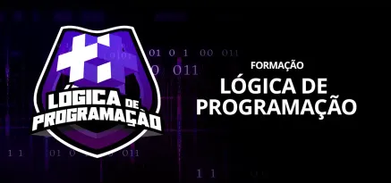

### FORMAÇÃO LÓGICA DE PROGRAMAÇÃO

Repositório para implementação e estudo dos códigos desenvolvidos durante o curso **Formação Lógica de Programação**, oferecido pela plataforma de ensino **Digital Innovation One - DIO**.

### Links

- [Digital Innovation One (DIO)](https://www.dio.me)
- [Formação Lógica de Programação](https://www.dio.me/curso-logica-programacao)

### Conceitos Desenvolvidos

- **Introdução à Lógica de Programação**
    - Algoritmos
    - Fluxogramas
        - Estruturas de Início e Fim de Fluxo
        - Estruturas de Dados de Entrada
        - Estruturas de Decisão
        - Estruturas de Ação
        - Estruturas de Looping
        - Estruturas de Saída
    - Input, process e output
    - Features (funcionalidades)
    - IDE (Ambiente de Desenvolvimento Integrado)
    - Variáveis
        - string
        - number
        - boolean
    - Comentários
    - Constantes
    - Vetores e Matrizes

- **Operadores**
    - operadores aritméticos
        - soma (+)
        - subtração (-)
        - multiplicação (*)
        - divisão (/)
        - módulo (%) - resto da divisão
    - operadores de incremento e decremento
        - incremento (++)
        - decremento (--)
    - operadores de atribuição
        - atribuição (=)
        - adição e atribuição (+=)
        - subtração e atribuição (-=)
        - multiplicação e atribuição (*=)
        - divisão e atribuição (/=)
        - módulo e atribuição (%=)
    - operadores relacionais
        - igual (==) - compara valor
        - igual (===) - compara valor e formato
        - diferente (!=)
        - diferente (!==)
        - maior que (>)
        - menor que (<)
        - maior ou igual a (>=)
        - menor ou igual a (<=)
    - operadores lógicos
        - AND (&&)
        - OR (||)
        - NOT (!)